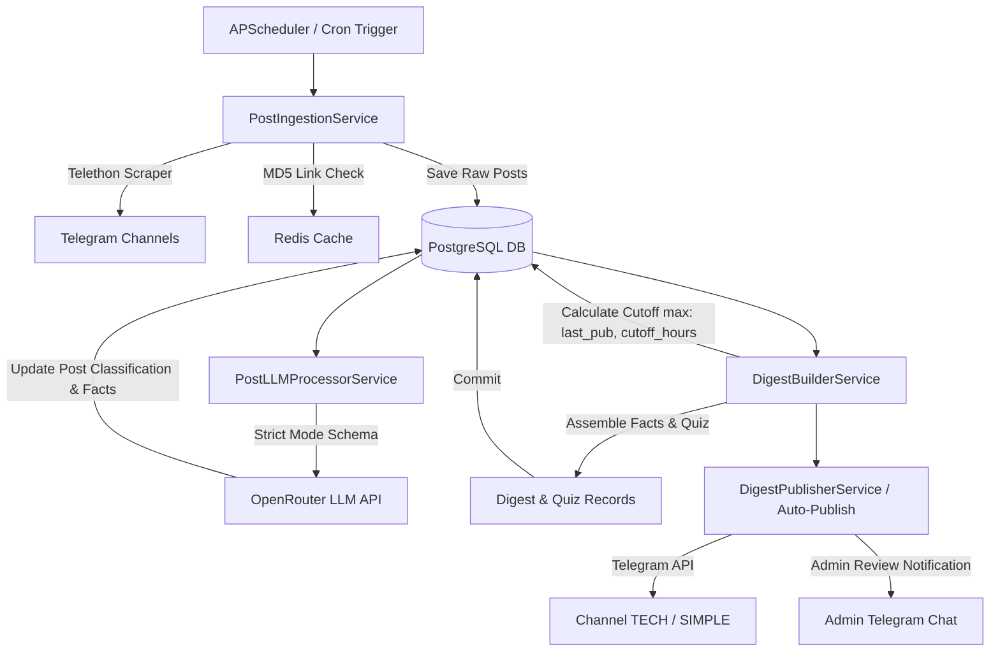

# AI Quiz Bot — Project Architecture & Context Guide

---

## 1. Project Overview & Core Purpose

`ai-quiz-bot` is an automated Telegram pipeline and interactive Telegram bot designed for processing AI news, building daily digests, generating periodic quizzes, and tracking user participation.

### Key Capabilities
1. **Telegram Channel Scraping**: Automatically parses configured Telegram channels using Telethon (MTProto).
2. **Dual-Audience LLM Classification**: Processes raw posts via OpenRouter LLM APIs (configurable models, e.g., Gemini 2.5 Flash for cheap/fast classification and DeepSeek V4 Pro for heavy assembly) to classify content for two target audiences:
   - **Tech**: Engineers, ML developers, architects (focus on benchmarks, code, architecture, parameters).
   - **Simple**: Business managers, product leads, casual readers (focus on practical impact, product updates).
3. **Daily Digest Assembly**: Assembles daily digests restricted to posts from the recent cutoff window (configurable, defaults to 24 hours or since the last published digest), preventing multi-day post accumulation.
4. **Periodic Quiz Generation**: Filters candidate questions from recent posts (configurable period, defaults to 7 days; typically executed on Sundays by default) and selects up to N questions (configurable, defaults to 5) using LLM structured outputs.
5. **Channel Auto-Publishing & Admin Approval**: Formats posts into Telegram HTML, splits long messages, and auto-publishes or sends review drafts with inline keyboards to an admin.
6. **Interactive Bot**: Built on Aiogram 3, providing quiz polls, user answer tracking, leaderboards, and error review ("Работа над ошибками").

---

## 2. Directory & Component Architecture

```
ai-quiz-bot/
├── core/                   # System core (Settings, DB, Redis, Constants)
│   ├── config.py           # Strongly-typed Pydantic Settings class (configurable via env)
│   ├── constants.py        # App-wide configurable defaults & thresholds
│   ├── database.py         # PostgreSQL AsyncEngine & session lifecycle
│   └── redis.py            # Redis client & session context managers
│
├── services/               # Single-responsibility business services
│   ├── ingestion.py        # PostIngestionService (Telegram scraping & deduplication)
│   ├── llm_processor.py    # PostLLMProcessorService (Batch post analysis)
│   ├── digest_builder.py   # DigestBuilderService (Configurable cutoff, assembly, quiz selection)
│   ├── publisher.py        # DigestPublisherService (Telegram publishing & admin notifications)
│   └── pipeline.py         # DigestPipeline (Facade orchestrating ingestion, LLM, builder)
│
├── utils/                  # Utility helper modules
│   ├── text_helpers.py     # split_text, markdown_to_html, deep_clean
│   ├── time_utils.py       # get_moscow_now, get_seven_days_ago, get_cutoff_time
│   ├── media_helpers.py    # extract_valid_media_paths
│   └── logger.py           # Structured JSON logging setup
│
├── schemas/                # Pydantic LLM Response Schemas & Strict Mode Transformer
│   └── llm_schemas.py      # PostAnalysisSchema, WeeklyQuizSchema, to_strict_json_schema()
│
├── prompts/                # LLM Prompt Management
│   ├── templates.py        # Prompt string templates
│   └── builders.py         # Prompt formatting functions
│
├── tg_bot/                 # Aiogram 3 Bot Application
│   ├── handlers/           # Route handlers (polls, quizzes, leaderboard, review, admin)
│   ├── keyboards/          # Inline keyboard button generators (admin review UI)
│   ├── middlewares/        # DB Session Middleware & Elastic APM Middleware
│   └── publisher.py        # Proxy module for backward compatibility
│
├── models/                 # SQLAlchemy 2.0 Async Models
│   ├── base.py             # Base & TimeStampMixin
│   ├── post.py             # Post model
│   ├── digest.py           # Digest & PublishedDigest models
│   ├── quiz.py             # Quiz model
│   ├── user.py             # User model
│   └── user_answers.py     # UserAnswer model
│
├── parser/                 # Scheduler & Legacy Proxy Imports
│   ├── scheduler.py        # APScheduler cron loop (configurable times) & metrics snapshot
│   ├── telegram_parser.py  # TGParser wrapper using Telethon
│   └── llm_layer.py        # MessageExtractor wrapper
│
├── migrations/             # Alembic database migration scripts
├── tests/                  # Test suite
│   ├── unit/               # Fast isolated unit tests
│   ├── integration/        # Database & service integration tests
│   └── e2e/                # End-to-end live pipeline test
│
├── run_bot.py              # Entry point for running the Aiogram 3 bot
└── docker-compose.yml      # Docker container configuration
```

---

## 3. Data Pipelines & Execution Flow

### Pipeline Flow Diagram


### Detailed Pipeline Steps

1. **Ingestion (`PostIngestionService`)**:
   - Loops through channels configured in `TG_SOURCES`.
   - Hashes URLs with MD5 and checks against Redis (`tg_post:<md5>`).
   - Checks DB for duplicate links before inserting raw `Post` entries.

2. **LLM Processing (`PostLLMProcessorService`)**:
   - Fetches unprocessed posts (`is_ad_or_trash.is_(None)`) from the configurable lookback period (defaults to 7 days).
   - Formats prompts and sends them to OpenRouter using `PostAnalysisSchema.to_dict_schema()`.
   - Uses `to_strict_json_schema()` to ensure 100% Strict Mode compliance (`additionalProperties: False`, all properties in `required`).
   - Updates `Post` with `is_tech_relevant`, `is_simple_relevant`, `tech_facts`, `simple_facts`, `tech_questions`, `simple_questions`, and token usage.

3. **Digest Assembly (`DigestBuilderService`)**:
   - Queries the last published digest timestamp for `digest_type` (`tech` or `simple`).
   - Sets `cutoff_date = get_cutoff_time(last_pub_date, hours=DEFAULT_CUTOFF_HOURS)` (configurable window, defaults to 24 hours).
   - Filters candidate posts where `post_date >= cutoff_date` and `digest_id IS NULL`.
   - Assembles Markdown facts with source links (`[Источник](url)`).
   - When quiz flag is active (`is_sunday_quiz=True`), collects lookback questions and calls LLM to select up to N questions (configurable, defaults to 5) using `WeeklyQuizSchema.to_dict_schema()`.
   - Creates `Digest` and `Quiz` records in DB.

4. **Publishing (`DigestPublisherService`)**:
   - Routes publishing to target channels (configured via `CHANNEL_ID_TECH` or `CHANNEL_ID_SIMPLE`, with fallback to `CHANNEL_ID`).
   - Converts Markdown to HTML using `markdown_to_html()`.
   - Splits long text using `split_text()` (configurable limit, defaults to 3500 characters).
   - Records publication entry in `PublishedDigest`.

---

## 4. Configuration & Environment Variables

All settings are managed by [`core/config.py`](file:///home/timur/ai-quiz-bot/core/config.py) and [`core/constants.py`](file:///home/timur/ai-quiz-bot/core/constants.py) using strongly-typed Pydantic properties. Note that default values (such as model choices, timeouts, and thresholds) are fully configurable via environment variables or settings overrides.

| Key | Description | Configurable Default / Example |
| :--- | :--- | :--- |
| `DB_USER` | PostgreSQL Username | `postgres` |
| `DB_PASSWORD` | PostgreSQL Password | `postgres` |
| `DB_NAME` | PostgreSQL Database Name | `ai_quiz_bot` |
| `DB_HOST` | Database Host | `localhost` / `postgres` |
| `DB_PORT` | Database Port | `5432` / `5434` |
| `REDIS_HOST` | Redis Server Host | `localhost` / `redis` |
| `REDIS_PORT` | Redis Server Port | `6379` |
| `TELEGRAM_API_ID` | Telethon App API ID | Integer |
| `TELEGRAM_API_HASH` | Telethon App API Hash | String |
| `BOT_TOKEN` | Aiogram Bot Token | String |
| `CHANNEL_ID` | Fallback Telegram Channel | `-100...` |
| `CHANNEL_ID_TECH` | Technical Digest Channel | `-100...` |
| `CHANNEL_ID_SIMPLE` | Popular Digest Channel | `-100...` |
| `ADMIN_TELEGRAM_ID` | Admin User ID for Review | Integer / String |
| `OPENROUTER_API_KEY` | OpenRouter API Key | String |
| `LLM_CHEAP_MODEL` | Fast LLM for classification | Configurable (default: `DEFAULT_CHEAP_MODEL`) |
| `LLM_EXPENSIVE_MODEL` | Heavy LLM for digest/quiz | Configurable (default: `DEFAULT_EXPENSIVE_MODEL`) |
| `AUTO_PUBLISH` | Enable automatic publishing | Configurable (default: `True`) |
| `DOWNLOAD_MEDIA` | Save Telegram media locally | Configurable (default: `False`) |

---

## 5. Development, Testing & Operation Commands

### Virtual Environment Execution
Always execute commands using the project's virtual environment:

```bash
# Run full test suite (Unit, Integration, E2E)
./.venv/bin/pytest

# Run fast unit & integration tests only
./.venv/bin/pytest tests/unit/ tests/integration/

# Run scheduler daemon (Cron jobs: Daily digest cycle, DB metrics snapshot)
./.venv/bin/python parser/scheduler.py

# Run interactive Telegram bot polling
./.venv/bin/python run_bot.py
```

### Database Migrations (Alembic)
```bash
# Generate a new migration
./.venv/bin/alembic revision --autogenerate -m "description"

# Apply pending migrations
./.venv/bin/alembic upgrade head
```

---

## 6. Technical Debt, Bottlenecks & Future Roadmap

### 1. Synchronous Thread Pool Bottleneck in LLM Layer
- **Current State**: [`parser/llm_layer.py`](file:///home/timur/ai-quiz-bot/parser/llm_layer.py) uses `asyncio.to_thread` wrapping a synchronous `httpx.Client` and `OpenAI` client.
- **Bottleneck**: Under heavy load (e.g. processing large batches of posts), thread pool exhaustion can delay post processing.
- **Recommendation**: Refactor `MessageExtractor` to use `httpx.AsyncClient` with `asyncio.gather` and an `asyncio.Semaphore`.

### 2. Telethon MTProto Single-Session Scraper
- **Current State**: Scraping relies on a single Telethon session file (`event_session.session`).
- **Bottleneck**: Parsing many channels in sequence can trigger Telegram `FloodWaitError` limits.
- **Recommendation**: Implement multi-session proxy rotation or an asynchronous ingestion task queue (e.g. Celery / ARQ / SAQ).

### 3. Database Metrics Query Aggregation
- **Current State**: [`run_metrics_snapshot()`](file:///home/timur/ai-quiz-bot/parser/scheduler.py#L134) runs aggregate SQL queries (`func.count`, `func.sum`) across the full `Post` and `UserAnswer` tables.
- **Bottleneck**: As the database grows beyond 100k posts/answers, sequential table scans will slow down metrics collection.
- **Recommendation**: Ensure composite database indexes exist on `Post(is_ad_or_trash, post_date)` and `UserAnswer(is_correct, user_id)`.

### 4. Admin Review Media Group Handling
- **Current State**: Admin manual review messages send media groups and chunked messages. If a digest draft contains many images, it sends multiple media groups.
- **Recommendation**: Cap admin preview images to a configurable maximum of top media files.

---

## 7. Operational Guidelines & Coding Standards

1. **Preserve Pydantic & Core Layer**: Always import settings via `from core.config import get_settings` and database sessions via `from core.database import get_db_session`. Do not introduce raw `os.getenv` calls directly in business logic.
2. **Maintain Strict JSON Schemas**: Any new LLM response schemas must be added as Pydantic models in [`schemas/llm_schemas.py`](file:///home/timur/ai-quiz-bot/schemas/llm_schemas.py) and wrapped with `to_strict_json_schema()`.
3. **Keep Tests Green**: Run `./.venv/bin/pytest` after any modifications to ensure all unit, integration, and E2E tests pass.
