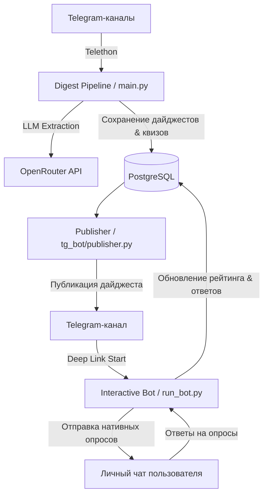

# AI Quiz Bot & Digest Pipeline

Автоматизированный комплекс для сбора новостей и постов из Telegram-каналов, их интеллектуального анализа и суммаризации с помощью LLM (OpenRouter / Gemini / DeepSeek), генерации дайджестов, интерактивных квизов и ведения рейтинга пользователей.

---

## 📌 Основные возможности

- 📡 **Автоматический парсинг Telegram-каналов**: Интеграция с Telethon для сбора свежих публикаций из целевых источников.
- 🧠 **Умная обработка через LLM**:
  - Фильтрация рекламы и нерелевантного контента.
  - Извлечение фактов, структурирование и объединение постов по темам.
  - Генерация готовых дайджестов в формате HTML/Markdown.
  - Автоматическое создание квиз-вопросов с несколькими вариантами ответов и пояснениями.
- 📢 **Автопубликация в Telegram-канал**: Публикация дайджеста в указанный канал с прикреплением deep-link ссылок на прохождение квиза.
- 🤖 **Интерактивный Telegram-бот (aiogram 3)**:
  - Проведение квизов в формате нативных Telegram-опросов (Polls) в личных сообщениях.
  - Учет баллов пользователей и защита от повторного прохождения.
  - Таблица лидеров (`/leaderboard`).
  - Режим «Работа над ошибками» (`/review`) для повторения ранее отвеченных неверно вопросов.
- 📊 **Мониторинг и логирование (ELK Stack)**:
  - Структурированное JSON-логирование.
  - Встроенная поддержка Elastic APM, Elasticsearch, Kibana и Filebeat для трейсинга и анализа логов.

---

## 🏗 Архитектура системы

Система состоит из двух основных исполняемых сервисов, взаимодействующих через общую PostgreSQL и Redis:



---

## 🛠 Пререквизиты

Для запуска проекта потребуются:

1. **Docker & Docker Compose** (рекомендуемый способ запуска).
2. **Python 3.11+** (если запуск выполняется локально без Docker).
3. **Telegram Bot Token** — получить у [@BotFather](https://t.me/BotFather).
4. **Telegram API ID & API Hash** — получить на [my.telegram.org](https://my.telegram.org) (для работы парсера Telethon).
5. **OpenRouter API Key** — ключ доступа к LLM на [openrouter.ai](https://openrouter.ai).

---

## 📂 Структура проекта

```text
ai-quiz-bot/
├── config/                  # Конфигурации сервисов (Filebeat, Elasticsearch)
├── migrations/              # Миграции базы данных Alembic
├── models/                  # SQLAlchemy ORM модели (User, Digest, Post, Quiz и др.)
├── parser/                  # Модуль сбора и LLM-обработки
│   ├── llm_layer.py         # Запросы к OpenRouter API
│   ├── post_extractor.py    # Логика извлечения и связывания постов
│   ├── prompts.py           # Промпты для фильтрации, дайджеста и квизов
│   ├── scheduler.py         # Периодический запуск задач (APScheduler)
│   ├── sources.py           # Список целевых Telegram-каналов
│   └── telegram_parser.py   # Клиент Telethon для сбора постов
├── tg_bot/                  # Интерактивный Telegram-бот и публикатор
│   ├── handlers/            # Обработчики команд, опросов и меню
│   ├── middlewares/         # Middleware (сессия БД, Elastic APM)
│   ├── bot_instance.py      # Инициализация экземпляра aiogram Bot
│   └── publisher.py         # Публикация дайджестов в Telegram-канал
├── utils/                   # Вспомогательные утилиты (логирование)
├── alembic.ini              # Настройки миграций Alembic
├── docker-compose.yml       # Оркестрация контейнеров Docker
├── Dockerfile               # Сборка образа приложения
├── main.py                  # Точка входа в Digest Pipeline (Scheduler)
├── run_bot.py               # Точка входа в Telegram-бота (Long Polling)
├── requirements.txt         # Зависимости Python
└── documentation.md         # Техническая документация архитектуры
```

---

## ⚙️ Настройка окружения (`.env`)

Создайте файл `.env` в корневой директории проекта и укажите необходимые переменные:

```env
# Telegram Bot & API credentials
TELEGRAM_API_ID=12345678
TELEGRAM_API_HASH=your_telegram_api_hash
BOT_TOKEN=1234567890:ABCdefGHIjklMNOpqrsTUVwxyZ
CHANNEL_ID=-1001234567890

# OpenRouter API Key
OPENROUTER_API_KEY=sk-or-v1-xxxxxxxxxxxxxxxx

# PostgreSQL Database Settings
DB_USER=ai_quiz_user
DB_PASSWORD=secure_db_password
DB_NAME=ai_digest_db
DB_HOST=db
DB_PORT=5432

# Redis Settings
REDIS_HOST=redis
REDIS_PASSWORD=secure_redis_password

# Настройки обработки LLM
MAX_POSTS_TO_PROCESS_LLM=100
LLM_CHEAP_MODEL=google/gemini-2.5-flash
LLM_EXPENSIVE_MODEL=deepseek/deepseek-v4-pro

# ELK & APM (Опционально)
ELASTIC_QUIZ_PASSWORD=elastic_password
KIBANA_QUIZ_SYSTEM_PASSWORD=kibana_password
ELASTIC_APM_QUIZ_SECRET_TOKEN=apm_secret_token
ELASTIC_APM_SERVER_URL=http://apm-server-quiz:8200
ELASTIC_APM_SERVICE_NAME=ai-quiz-bot
ELASTIC_APM_ENVIRONMENT=production
```

---

## 🚀 Инструкция по запуску

### Вариант 1. Запуск через Docker Compose (Рекомендуемый)

1. **Клонируйте репозиторий**:
   ```bash
   git clone https://github.com/TimurNikitenko/ai-quiz-bot.git
   cd ai-quiz-bot
   ```

2. **Создайте и заполните `.env`**:
   ```bash
   cp .env.example .env   # или создайте .env вручную
   ```

3. **Запустите контейнеры**:
   ```bash
   docker compose up -d --build
   ```

4. **Проверьте статус запущенных сервисов**:
   ```bash
   docker compose ps
   ```

   При старте `digest_pipeline` автоматически применит миграции Alembic (`alembic upgrade head`) перед запуском `main.py`.

---

### Вариант 2. Локальный запуск для разработки

1. **Создайте и активируйте виртуальное окружение**:
   ```bash
   python3 -m venv .venv
   source .venv/bin/activate
   ```

2. **Установите зависимости**:
   ```bash
   pip install --upgrade pip
   pip install -r requirements.txt
   ```

3. **Запустите сервисы PostgreSQL и Redis** (например, через Docker):
   ```bash
   docker compose up -d db redis
   ```

4. **Примените миграции базы данных**:
   ```bash
   env DB_HOST=localhost .venv/bin/alembic upgrade head
   ```

5. **Запустите пайплайн сбора и обработки**:
   ```bash
   env DB_HOST=localhost REDIS_HOST=localhost python main.py
   ```

6. **Запустите Telegram-бота в отдельном терминале**:
   ```bash
   env DB_HOST=localhost REDIS_HOST=localhost python run_bot.py
   ```

7. **(Опционально) Публикация дайджеста вручную**:
   ```bash
   env DB_HOST=localhost REDIS_HOST=localhost python -m tg_bot.publisher [DIGEST_ID]
   ```

---

## 🛠 Миграции базы данных (Alembic)

При изменении ORM-моделей в директории `models/` необходимо создавать и применять миграции:

- **Создание новой миграции**:
  ```bash
  env DB_HOST=localhost .venv/bin/alembic revision --autogenerate -m "описание_изменений"
  ```
- **Применение миграций**:
  ```bash
  env DB_HOST=localhost .venv/bin/alembic upgrade head
  ```

---

## 🤖 Команды Telegram-бота

Пользователи в личных сообщениях с ботом могут использовать следующие команды:

- `/start` — Запуск бота / обработка deep-link ссылок (например, `t.me/bot?start=quiz_12`).
- `/help` — Справка по возможностям бота и правилам прохождения квизов.
- `/leaderboard` — Таблица участников с наибольшим количеством набранных очков.
- `/review` — Запуск режима «Работа над ошибками» (вывод до 5 вопросов, на которые пользователь ранее ответил неверно).

---

## 📊 Мониторинг и логирование (ELK Stack)

Проект включает изолированный стек стек логирования и APM (Elasticsearch 8.13, Kibana, APM Server, Filebeat):

- **Kibana UI**: Доступен по адресу `http://localhost:5602` (по умолчанию закоммичена конфигурация порта 5602).
- **APM Server**: Принимает метрики и трейсы по адресу `http://localhost:8201` (`http://apm-server-quiz:8200` внутри Docker-сети).
- **Логи приложения**: Все логи выводится в JSON-формате и автоматически собираются Filebeat с контейнеров `tg_bot` и `digest_pipeline`.

---

## 🔍 Диагностика и полезные команды

- **Просмотр логов бота**:
  ```bash
  docker logs -f tg_bot
  ```
- **Просмотр логов пайплайна сбора**:
  ```bash
  docker logs -f digest_pipeline
  ```
- **Перезапуск контейнеров**:
  ```bash
  docker compose restart
  ```
- **Подключение к Redis**:
  ```bash
  docker exec -it digest_redis redis-cli -a 'YOUR_REDIS_PASSWORD'
  ```
- **Подключение к PostgreSQL**:
  ```bash
  docker exec -it digest_postgres psql -U YOUR_DB_USER -d YOUR_DB_NAME
  ```
