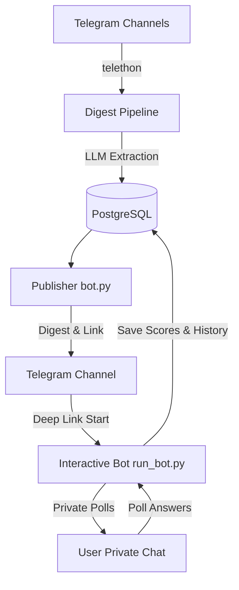
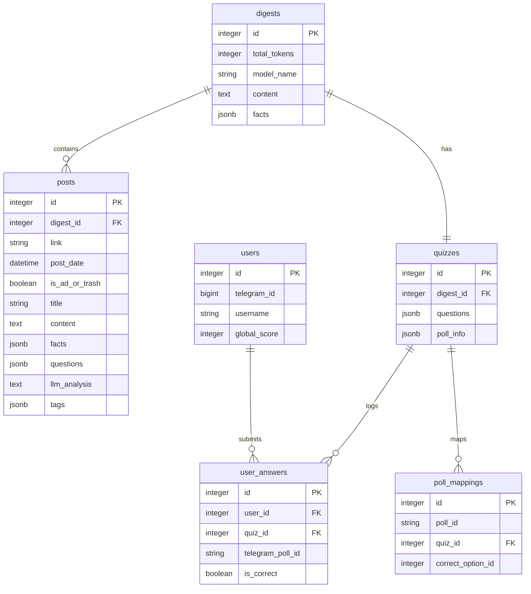

# Maintenance & Architecture Documentation

This document describes the design, architecture, and maintenance workflows for the AI Quiz Bot and Digest Pipeline.

---

## 1. System Architecture

The project consists of two primary runtime components communicating through a shared PostgreSQL database and a Redis instance:



1. **Digest Pipeline (`main.py` / `post_extractor.py`)**:
   - Periodically connects to target Telegram channels using Telethon.
   - Extracts messages, analyzes them using LLMs (via OpenRouter), groups them, generates facts, digests, and quiz questions.
   - Saves digests and quizzes into Postgres.

2. **Publisher (`bot.py`)**:
   - Executed as a single-run script to publish the latest digest and its associated quiz.
   - Formats and sends the digest to the configured Telegram channel.
   - Attaches an inline keyboard button pointing to the bot with a deep link (`t.me/bot?start=quiz_<digest_id>`).

3. **Interactive Bot (`run_bot.py`)**:
   - Long-polling daemon that handles user interaction.
   - Parses deep links when users click "Take Quiz" from the channel.
   - Delivers quiz questions as native, non-anonymous polls to the user's private chat.
   - Receives `poll_answer` events, checks correctness, logs the action, and awards ratings.

---

## 2. Database Schema & Relationships



### Table Definitions

* **`digests`**: Stores the assembled daily/weekly digests.
* **`posts`**: Individual posts extracted from source channels.
* **`quizzes`**: Stores quizzes associated with digests. The `questions` column contains a JSONB list of questions, their choices, the correct choice text, and explanations.
* **`users`**: Registers Telegram users who have interacted with the bot. Maintains their lifetime `global_score`.
* **`user_answers`**: Stores history of user responses. Ensures that a user cannot submit answers to the same question twice and tallies scores.
* **`poll_mappings`**: Maps dynamic Telegram `poll_id`s (which are unique per user-send) back to the static `quiz_id` and the correct option index.

---

## 3. Core Flows & Code Paths

### 3.1. Publishing Quizzes

When the digest is published to the channel (`bot.py`):
1. The script fetches the bot's username dynamically using `bot.get_me()`.
2. It constructs a deep link:
   ```python
   quiz_link = f"https://t.me/{bot_username}?start=quiz_{digest.id}"
   ```
3. It sends the digest and then publishes an invite message with an `InlineKeyboardButton` carrying the deep link.

### 3.2. Launching Quizzes in Private Chat

In `tg_bot/handlers/quiz.py`:
1. When `/start quiz_<digest_id>` is received, the handler fetches the `Quiz` and checks if the user has already answered any questions for this quiz (`select(UserAnswer)`).
2. If the user has already taken the quiz, the bot replies with their score.
3. If not, the bot loops through the questions, shuffles the options, sends them as native quizzes, and maps the returned `poll.id` to the quiz using the `PollMapping` model:
   ```python
   poll_message = await bot.send_poll(
       chat_id=tg_user_id,
       question=q["question"],
       options=shuffled_options,
       type="quiz",
       correct_option_id=new_correct_id,
       is_anonymous=False,
       explanation=q.get("explanation")[:200]
   )
   
   poll_mapping = PollMapping(
       poll_id=poll_message.poll.id,
       quiz_id=quiz.id,
       correct_option_id=new_correct_id
   )
   session.add(poll_mapping)
   ```

### 3.3. Evaluating Answers and Rating Updates

In `tg_bot/handlers/polls.py`:
1. When a user submits an answer, `@router.poll_answer()` intercepts the `PollAnswer` object.
2. The handler checks the `poll_id` against `poll_mappings` to determine the corresponding `quiz_id` and `correct_option_id`.
3. If the selected option matches, the user's `global_score` is incremented.
4. If this answer completes the quiz (i.e. `UserAnswer` count matches the number of questions in `Quiz.questions`), the bot sends a completion message:
   ```
   🎉 Вы прошли квиз!
   📊 Результат: X из Y правильных ответов.
   🏆 Ваш общий рейтинг: Z баллов.
   ```

---

## 4. Maintenance Workflows

### 4.1. Local Database Migrations

Whenever models are modified (e.g., in the `models/` directory):
1. **Generate a migration**:
   Ensure PostgreSQL is running locally (exposed to `127.0.0.1:5432`). Run the following command with `DB_HOST` pointed to your local environment:
   ```bash
   env DB_HOST=localhost .venv/bin/alembic revision --autogenerate -m "description_of_change"
   ```
2. **Apply migrations**:
   ```bash
   env DB_HOST=localhost .venv/bin/alembic upgrade head
   ```

### 4.2. Diagnostic Commands

* **View Bot Logs**:
  ```bash
  docker logs -f tg_bot
  ```
* **View Pipeline Logs**:
  ```bash
  docker logs -f digest_pipeline
  ```
* **Restart the Stack**:
  ```bash
  docker-compose down && docker-compose up -d
  ```
* **Reset Database Volume (Destructive)**:
  ```bash
  docker-compose down -v && docker-compose up -d db
  ```
